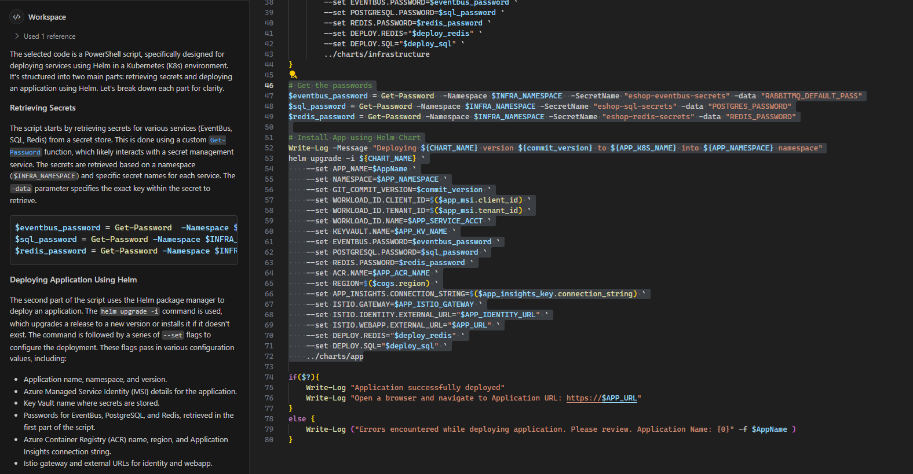

Overview
=================
This repository is a workshop that demonstrates a method to deploy the eShop application to Azure Kubernetes Service (AKS). The [eShop application](https://github.com/dotnet/eshop) is a sample .NET 8 microservices application based on the [Aspire framework](https://learn.microsoft.com/en-us/dotnet/aspire/get-started/aspire-overview). An accompanying ebook on the eShop application can be found [here](https://learn.microsoft.com/en-us/dotnet/architecture/cloud-native/introduce-eshoponcontainers-reference-app).

  

Detaild Documentation
============
[Table of Contents](./toc.md)

High Level Architecture
============
The following is high level architecture of the eShop application and its Azure components. 

    
    

(<a href="#overview">back to top</a>)

Copilot
============
If you need clarification on any documentation, you can leverage Github Copilot for assitance. Just highlight the code snippet and type `/explian` in the Copilot prompt.

    
    

Roadmap
============
- [x] Build container images
- [x] Deploy to Kubernetes
- [x] Add Keda Scalers Examples
- [x] Review Azure Monitor and Application Insights
- [x] Update documentation
- [ ] A Java-based Version

(<a href="#overview">back to top</a>)

Acknowledgments
============
* [The eShop Team](https://github.com/dotnet/eshop)
* [The dotnet Team](https://github.com/dotnet)
* [Azure Mission Critical](https://github.com/Azure/Mission-Critical-Connected)
* [Reliable Web Workshop](https://github.com/Azure/reliable-web-app-pattern-dotnet-workshop)
* [Ben Coleman](https://github.com/benc-uk/kube-workshop)

(<a href="#overview">back to top</a>)

