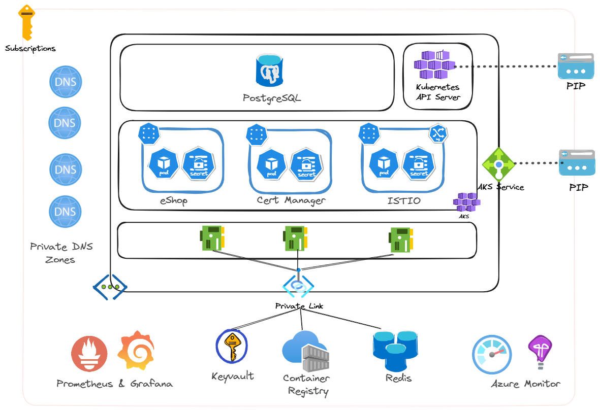

Overview
=================
This repository is a workshop that demonstrates a method to deploy the eShop application to Azure Kubernetes Service (AKS). The [eShop application](https://github.com/dotnet/eshop) is a sample .NET 8 microservices application based on the [Aspire framework](https://learn.microsoft.com/en-us/dotnet/aspire/get-started/aspire-overview). An accompanying ebook on the eShop application can be found [here](https://learn.microsoft.com/en-us/dotnet/architecture/cloud-native/introduce-eshoponcontainers-reference-app).

  

The following is high level architecture of the eShop application and its Azure components. 

    
    

(<a href="#overview">back to top</a>)

Table of contents
=================
<!--ts-->
* [Architecture](./docs/architecture.md#architecture)
    * [Technology Stack](./docs/architecture.md#technology-stack)
    * [Webapp](./docs/architecture.md#webapp)
    * [Services - Basket API](./docs/architecture.md#basket-api)
    * [Services - Catalog API](./docs/architecture.md#catalog-api)
    * [Services - Identity API](./docs/architecture.md#identity-api)
    * [Services - Ordering API](./docs/architecture.md#ordering-api)
    * [Services - Payment API](./docs/architecture.md#payment-api)
    * [Webhooks](./docs/architecture.md#webhooks)
    * [Code Updates to eShop](./docs/code.md)
* [Prerequisites](./docs/prerequisites.md)
    * [Tools](./docs/prerequisites.md#tools)
    * [Task](./docs/prerequisites.md#task)
    * [Gihub Codespaces](./docs/prerequisites.md#github-codespaces)
    * [Firewall Update](./docs/prerequisites.md#firewall)
* [Infrastructure](./docs/infrastructure.md)
    * [Infrastructure Task Steps](./docs/infrastructure.md#steps)
    * [Components - Resource Groups](./docs/infrastructure.md#resource-groups)
    * [Components - Networking](./docs/infrastructure.md#networking)
    * [Components - AKS Cluster](./docs/infrastructure.md#aks-cluster-components)
    * [Components - Monitoring](./docs/infrastructure.md#monitoring)
    * [Components - Redis](./docs/infrastructure.md#redis)
    * [Components - PostgreSQL](./docs/infrastructure.md#postgresql)
    * [Components - EventBus](./docs/infrastructure.md#eventbus)
    * [Components - OpenTelemetry](./docs/infrastructure.md#open-telemetry)
    * [Certificates](./docs/certificates.md)
    * [Example Setup](./docs/build.md#example-setup)
* [Application Build](./docs/build.md)
    * [Build Task Steps](./docs/build.md#steps)
    * [Example Build](./docs/build.md#example-build)
* [Application Deployment](./docs/deployment.md)
    * [Deployment Task Steps](./docs/deployment.md#steps)
    * [Components - Helm Chart](./docs/deployment.md#helm-chart)
    * [Components - Virtual Services](./docs/deployment.md#virtual-services)    
    * [Secrets & ConfigMaps](./docs/deployment.md#secrets--configmaps)
    * [Example Deployment](./docs/build.md#example-deployment)
* [Monitoring Application](./docs/monitoring.md)
    * [Open Telemetry Pipeline](./docs/monitoring.md#open-telemetry-pipeline)    
    * [Metrics Examples](./docs/monitoring.md#example-metrics---grafana-dashboards-and-prometheus-queries)
    * [Logging Examples](./docs/monitoring.md#example-application-logs---application-insights)
    * [Tracing Examples](./docs/monitoring.md#example-distributive-traces---application-insights)
    * [Optional Next Steps](./docs/monitoring.md#optional-next-steps)
* [Testing](./docs/testing.md)
    * [Playwright](./docs/testing.md#playwright)
    * [Chaos Engineering](./docs/testing.md#chaos-engineering) 
    * [Optional Next Steps](./docs/testing.md#optional-next-steps)
* [Scaling](./docs/scaling.md)
    * [Pod Disruption Budget](./docs/scaling.md#pod-disruption-budget)
    * [Keda HTTP Scaler](./docs/scaling.md#keda-http-scaler)
    * [Optional Next Steps](./docs/scaling.md#optional-next-steps)
* [Cost Management](./docs/cost-management.md)
* [Roadmap](#Roadmap)
* [Code of Conduct](./CODE_OF_CONDUCT.md)
* [Contributing](./CONTRIBUTING.md)
* [Acknowledgments](#Acknowledgments)
<!--te-->

(<a href="#overview">back to top</a>)

Roadmap
============
- [x] Build container images
- [x] Deploy to Kubernetes
- [x] Add Keda Scalers Examples
- [x] Review Azure Monitor and Application Insights
- [x] Update documentation

(<a href="#overview">back to top</a>)

Acknowledgments
============
* [The eShop Team](https://github.com/dotnet/eshop)
* [The dotnet Team](https://github.com/dotnet)
* [Azure Mission Critical](https://github.com/Azure/Mission-Critical-Connected)
* [Reliable Web Workshop](https://github.com/Azure/reliable-web-app-pattern-dotnet-workshop)
* [Ben Coleman](https://github.com/benc-uk/kube-workshop)

(<a href="#overview">back to top</a>)

