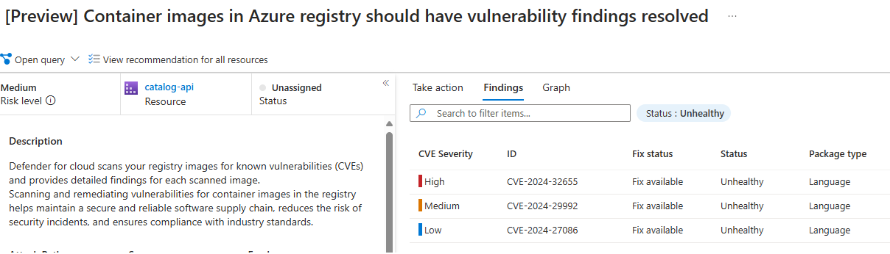

Build
=============
* The eShop application will build and publish the application to a container registry. The build step is dependent upon a successful infrastructure deployment from the previous section. 
* The build uses a feature of dotnet8 in which the `dotnet publish` command can create docker containers without the requirement of a the traditional `Dockerfile`.  Pushing to the containers to the Azure Container Registry does still require docker to be installed and running. 
* Each service in the eShop application is built and published using the following command as defined in the [scripts/modules/eshop_functions.ps1](https://github.com/briandenicola/eShopOnAKS/blob/main/scripts/modules/eshop_functions.ps1#L121) script.
* The build process is kicked off using the command: `task build` command which runs the `scripts/build-containers.ps1` script.  The script sets the application variables, subscription context. Then it logs into the Azure Container Registry, gets the latest git commit version id. Finally, it builds then publishes each service to the Azure Container Registry.

# Steps
## :heavy_check_mark: Deploy Task Steps
- :one: `task build -- ${{eSHOP_SRC_DIR}}`     - Builds and pushes the containers. `eSHOP_SRC_DIR` defaults to ~/code/eshop if not passed on the cli
  * Example `task build -- /workspaces/eShop` - if you are working on a Github Codespace
<p align="right">(<a href="#build">back to top</a>)</p>

## :heavy_check_mark: Manual Build Steps
```pwsh
  . ./scripts/modules/eshop_naming.ps1 -AppName $AppName
  $ContainerImageTag=$(git rev-parse HEAD | head -c 8)
  dotnet publish -t:PublishContainer -p ContainerImageTag=$ContainerImageTag -p ContainerRegistry=${APP_ACR_NAME}.azurecr.io src/Basket.API
  dotnet publish -t:PublishContainer -p ContainerImageTag=$ContainerImageTag -p ContainerRegistry=${APP_ACR_NAME}.azurecr.io src/Catalog.API
  dotnet publish -t:PublishContainer -p ContainerImageTag=$ContainerImageTag -p ContainerRegistry=${APP_ACR_NAME}.azurecr.io src/Identity.API
  dotnet publish -t:PublishContainer -p ContainerImageTag=$ContainerImageTag -p ContainerRegistry=${APP_ACR_NAME}.azurecr.io src/Mobile.Bff.Shopping
  dotnet publish -t:PublishContainer -p ContainerImageTag=$ContainerImageTag -p ContainerRegistry=${APP_ACR_NAME}.azurecr.io src/OrderProcessor
  dotnet publish -t:PublishContainer -p ContainerImageTag=$ContainerImageTag -p ContainerRegistry=${APP_ACR_NAME}.azurecr.io src/Ordering.API
  dotnet publish -t:PublishContainer -p ContainerImageTag=$ContainerImageTag -p ContainerRegistry=${APP_ACR_NAME}.azurecr.io src/PaymentProcessor
  dotnet publish -t:PublishContainer -p ContainerImageTag=$ContainerImageTag -p ContainerRegistry=${APP_ACR_NAME}.azurecr.io src/WebApp
  dotnet publish -t:PublishContainer -p ContainerImageTag=$ContainerImageTag -p ContainerRegistry=${APP_ACR_NAME}.azurecr.io src/Webhooks.API
```

## Optional Next Steps
* :bulb: Enable [Azure Defender for Container](https://portal.azure.com/#view/Microsoft_Azure_Security/SecurityMenuBlade/~/EnvironmentSettings) then push the containers again to your Container Registry. Review any [security recommendations](https://learn.microsoft.com/en-us/azure/defender-for-cloud/defender-for-containers-introduction).  How would you resolve the recommendations?



<p align="right">(<a href="#build">back to top</a>)</p>


# Example Build
```pwsh
  > task build
  task: [build] pwsh ./build-containers.ps1 -AppName airedale-60249 -SubscriptionName Apps_Subscription -SourceRootDirectory ~/code/eShop -verbose
  VERBOSE: [05/17/2024 14:27:36] - Setting subscription context to Apps_Subscription ...
  VERBOSE: [05/17/2024 14:27:37] - Logging into airedale60249containers Azure Container Repo ...
  Login Succeeded
  VERBOSE: [05/17/2024 14:27:39] - Get Latest Git commit version id ...
  VERBOSE: [05/17/2024 14:27:39] - Building and publish /home/brian/code/eShop/src/Basket.API:7be56fbd to airedale60249containers.azurecr.io ...
  MSBuild version 17.9.8+b34f75857 for .NET
    Determining projects to restore...
    All projects are up-to-date for restore.
    EventBus -> /home/brian/code/eShop/src/EventBus/bin/Release/net8.0/EventBus.dll
    eShop.ServiceDefaults -> /home/brian/code/eShop/src/eShop.ServiceDefaults/bin/Release/net8.0/eShop.ServiceDefaults.dll
    EventBusRabbitMQ -> /home/brian/code/eShop/src/EventBusRabbitMQ/bin/Release/net8.0/EventBusRabbitMQ.dll
    Basket.API -> /home/brian/code/eShop/src/Basket.API/bin/Release/net8.0/Basket.API.dll
    Basket.API -> /home/brian/code/eShop/src/Basket.API/bin/Release/net8.0/publish/
    Building image 'basket-api' with tags '7be56fbd' on top of base image 'mcr.microsoft.com/dotnet/aspnet:8.0'.
    Uploading layer 'sha256:09f376ebb190216b0459f470e71bec7b5dfa611d66bf008492b40dcc5f1d8eae' to 'airedale60249containers.azurecr.io'.
    Uploading layer 'sha256:89ef64df9fcef4318b596929f6c531b0ea4692f6f3b1bc51065a3e4d7204920b' to 'airedale60249containers.azurecr.io'.
    Uploading layer 'sha256:dda00774a7f984737f62e73eeba4dec3f7266790f3bd1cb073e7d2b4030e78e2' to 'airedale60249containers.azurecr.io'.
    Uploading layer 'sha256:7954f8acfab5a6b488754e38c8ca8d20d458e56504b2b0d73df09146a2fbc9ea' to 'airedale60249containers.azurecr.io'.
  ....
    Finished uploading layer 'sha256:b22a0bc0ecb25a862ea107320af39d32d91d56fbaeba3ccd66a4f5178e5107d8' to 'airedale60249containers.azurecr.io'.
    Layer 'sha256:7954f8acfab5a6b488754e38c8ca8d20d458e56504b2b0d73df09146a2fbc9ea' already exists.
    Uploading config to registry at blob 'sha256:a90eb5b8d24fbc2c73c87b006e77c286efe9472ab1b56d905b8fcb33ad999ea5',
    Uploaded config to registry.
    Uploading tag '7be56fbd' to 'airedale60249containers.azurecr.io'.
    Uploaded tag '7be56fbd' to 'airedale60249containers.azurecr.io'.
    Pushed image 'webhookclient:7be56fbd' to registry 'airedale60249containers.azurecr.io'.
  VERBOSE: [05/17/2024 14:28:57] - Application successfully built and pushed to airedale60249containers. . . ...
```
<p align="right">(<a href="#build">back to top</a>)</p>

# Navigation
[Previous Section ⏪](./certificates.md) ‖ [Return to Main Index 🏠](../README.md) ‖ [Next Section ⏩](./deployment.md)
<p align="right">(<a href="#build">back to top</a>)</p>