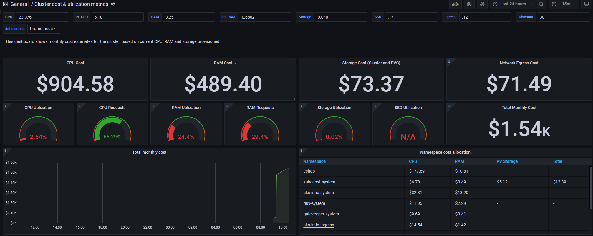
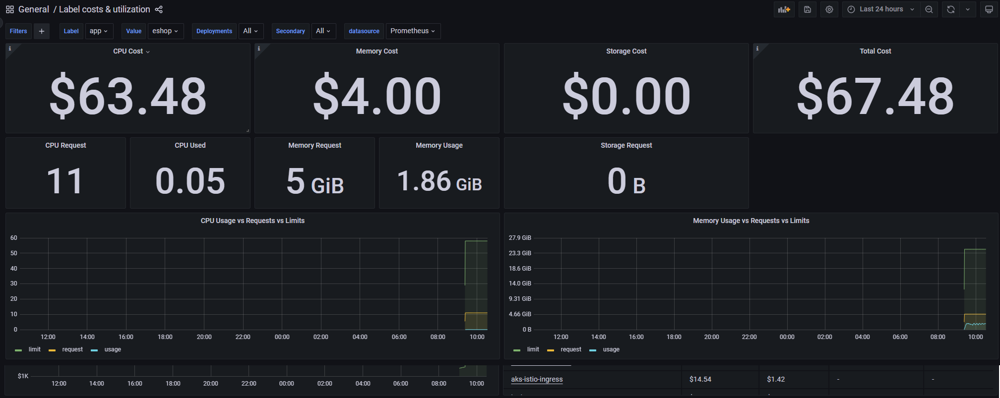

Cost Management
=============
[Cost management](https://learn.microsoft.com/en-us/azure/cloud-adoption-framework/scenarios/app-platform/aks/cost-governance-with-kubecost) is an important aspect of managing your Kubernetes cluster. In this section, we will explore how to manage costs of resources within your cluster using [Kubecost](https://www.kubecost.com/products/self-hosted).  

Kubecost exposes a Grafana Dasboard to view the cost details. To view the dashboard, portforward the Grafana service using the following command:
```pwsh
kubectl --namespace kubecost-system port-forward svc/kubecost-system-kubecost-release-grafana 9090:80
```
<p align="right">(<a href="#cost-management">back to top</a>)</p>

<hr/>

## Overall Costs

<p align="right">(<a href="#cost-management">back to top</a>)</p>

## Costs per Label

<p align="right">(<a href="#cost-management">back to top</a>)</p>

## Navigation
[Previous Section ⏪](./scaling.md)  ‖ [Return to Main Index 🏠](../README.md) 
<p align="right">(<a href="#cost-management">back to top</a>)</p>