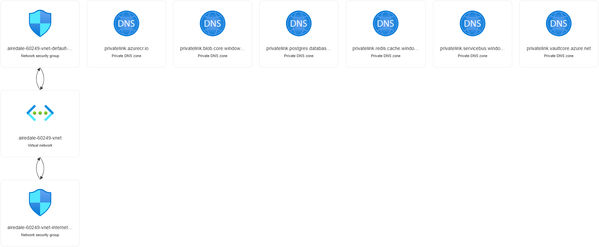
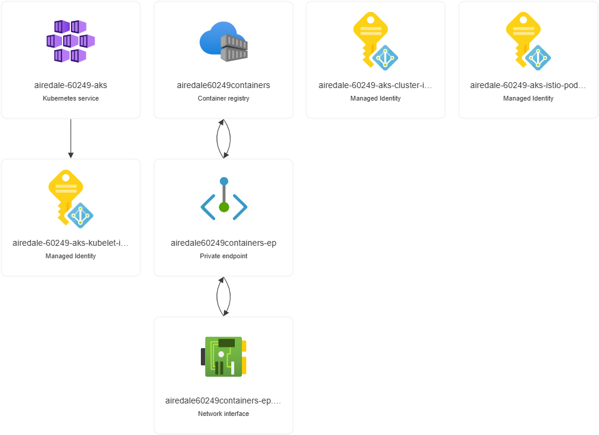
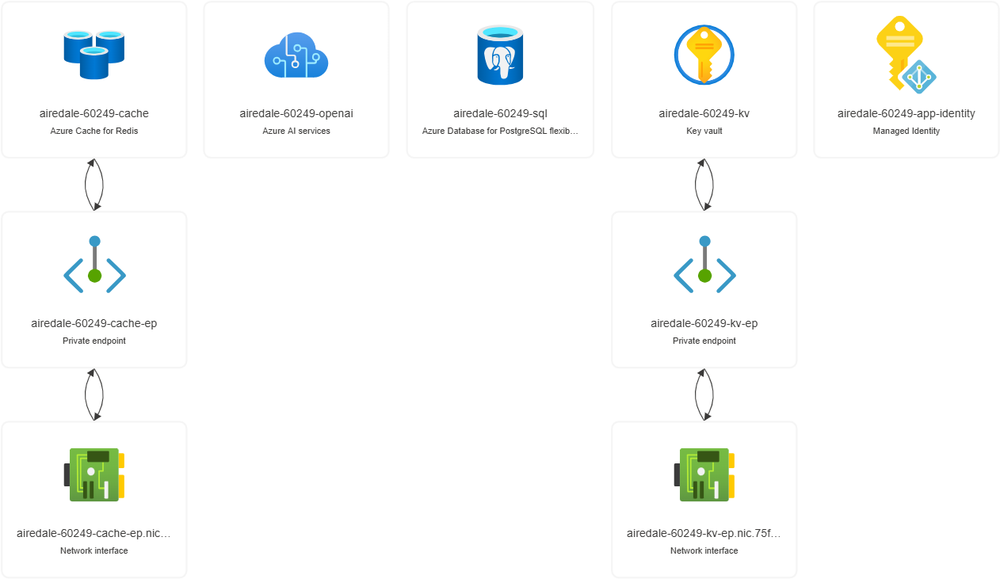

Infrastructure
============
* The eShop infrastructure is deployed to Azure using Terraform.  
* The build process is kicked off using the command: `task up` command which kick start terraform.  
* Afater the infrastructure is deployed, the `task creds` command is used to get the AKS credentials and the `task dns` command is display the data needed for the DNS record that needs to be created manually.
* Terraform will generate a random name that is used as the foundation for all the resources created in Azure.  The random name is generated using the `random_pet` and `random_integer` resources in Terraform.  This value should be saved as it is used throughout the deployment. The example name `airedale-60249` is used in the rest of the documents
* The infrastructure deploy can take up to 30 minutes to complete.
* The infrastructure is deployed to a single Azure region (defaults to `westus3`) and consists of the following components:

# Steps
## :heavy_check_mark: Deploy Task Steps
- :one: `task up`     - Initializes Terraform and then calls `task apply`, `task creds`, and `task dns`

### :heavy_check_mark: Or run the tasks individually
> _**Note**: If terraform fails for any resaon, you can run these commands individually to retry the deployment._
- :one: `task apply`  - Applies the Terraform plan to create the Azure infrastructure
- :two: `task creds`  - Gets the credential file for the newly created AKS cluster
- :three: `task dns`    - Gets the IP Address of the Istio Gateway

## :heavy_check_mark: Deploy Manually
```pwsh
  terraform -chdir=./infrastructure
  terraform -chdir=./infrastructure apply -var "region={{.REGION}}"  -var "vm_size={{.SKU}}" -var "node_count={{.COUNT}}"  -var "tags={{.TITLE}}"
  az aks get-credentials -g {{.AKS_NAME}} -n {{.RG}}
```

## Next Steps
* :bulb: eShop has an OpenAI component that can be deployed. What would be the steps to deploy and configure this component?
<p align="right">(<a href="#infrastructure">back to top</a>)</p>

# Infrastructure Components
## Resource Groups
Name | Usage
------ | ----
Application Resource Group ("${app_name}_app_rg") | Used by components of the eShop application
Core Resource Group ("${app_name}_core_rg") | Core networking infrastructure
AKS Resource Group ("${app_name}_aks_rg")| Components required for AKS and Container Registry 
Monitoring Resource Group ("${app_name}_monitoring_rg")| AppInsights, Grafrana, Prometheus, and other monitoring components 
Chaos Resource Group ("${app_name}_chaos_rg") | Chaos Engineering components

> **Note**: All resource groups are tagged with the `Application="eShop On AKS"`
<p align="right">(<a href="#infrastructure">back to top</a>)</p>

## Networking
* A single Azure virtual network with a /16 address space is created in the Core Resource Group.
* A subnet for AKS named `nodes` is created in the virtual network with a /24 address space.
* A subnet for AKS's API  named `api-server` is created in the virtual network and delegated to `Microsoft.ContainerService/managedClusters`
* A subnet for all Private Endpoints named `private-endpoints` is created with a /24 address space.
* A delegated subnet for PostgreSQL named `sql` is created with a /24 address space and delegated to `Microsoft.DBforPostgreSQL/flexibleServers`
* The virtual network uses Azure DNS for name resolution and all Private DNS Zones required for the Azure resources private endpoints are linked to the virtual network.
* The eShop application will be accessible from the internet and by default has a Domain Name under `bjdazure.tech`. This is intially defined in the `DOMAIN_ROOT` variable in the `Taskfile.yaml` file.
* One DNS record named `*.${APP_NAME}.${DOMAIN_ROOT}` needs to becreated in the Azure DNS zone for the eShop application as part of the application deployment.
<p align="right">(<a href="#infrastructure">back to top</a>)</p>

## AKS Cluster Components
* A managed AKS cluster is deployed to the AKS Resource Group with 2 node pools - one for system resources and one for user workloads.
* KeyVault CSI driver, Keda, and Azure Policy are enabled on the AKS cluster.
* The Flux operator is deployed to the AKS cluster to manage the deployment of post-deployment resources (see #GitOps below)
* The cluster is publically accessible but locked down to only allow traffic from your external IP address and requires Entra ID authentication for access
* An Azure container registry is deployed along side the AKS cluster to store the container images in the same resource group.
* Azure Service Mesh is installed as part of the cluster
<p align="right">(<a href="#infrastructure">back to top</a>)</p>

### Azure Service Mesh
* Azure Service Mesh is installed as part of the AKS cluster deployment.
* The default configuration is used for most of the Azure Service Mesh components.
* Customization for Azure Service Mesh is defined in the `istio-shared-configmap-asm-1-20` configmap that is deployed as part of the GitOps deployment defined below.
* The Azure Service Mesh is configured to forward trace logs to an Open Telemetry endpoing using the Zipkin protocol as defined:
```yaml
    defaultConfig:
      tracing:
        zipkin:
          address: otel-collector.otel-system.svc.cluster.local:9411
```

### Flux & GitOps
* The Flux operater is responsible for managing the deployment of additional components to the AKS cluster.
* Flux uses kustomize to apply the manifests in the `cluster-config` directory to the AKS cluster.
* Flux installs Cert-Manager to manage the certificates for the eShop application, Keda's HTTP Scaler, Kured for node reboots, and Kubecost for cost management.
* Flux also customizes Azure Service Mesh 
<p align="right">(<a href="#infrastructure">back to top</a>)</p>

### Workload Identity
* The application runs as a Managed Identity with the name format of ${APP_NAME}-app-identity
* The Managed Identity is federated with a AKS Service Account named ${APP_NAME}-app-identity to enable Workload Identities
* The Managed Identity is granted the `Key Vault Secrets User` role on the Key Vault
<p align="right">(<a href="#security">back to top</a>)</p>

## Monitoring
* Log Analytics Application Insights, Azure Managed Prometheus, and Grafana are deployed to the Monitoring Resource Group.
* All resources have their diagnostic settings enabled and are configured to send logs and metrics to Log Analytics.
* The AKS cluster is configured with Azure Managed Prometheus and Grafana for monitoring and visualization.
* Azure Monitor/Prometheus is deployed to the `westus2` region due to regional restrictions.
<p align="right">(<a href="#infrastructure">back to top</a>)</p>

## Redis
* Redis can be deployed either in Azure as a managed service or as a pod in the AKS cluster to save costs.
  * This is controled by the `DEPLOY_REDIS` variable in teh `Taskfile.yaml` file.
* If deployed in Azure, Azure Redis Cache is deployed using the Premium SKU with a predefined capacity of 1 GB.
  * It is deployed using Private Link and only accessible from the Azure virtual network.
  * It is deployed into the Application Resource Group.
* The connection string used by the `basket-api` is stored in the Azure Key Vault under the secret named `redis_connection_string`.
<p align="right">(<a href="#infrastructure">back to top</a>)</p>

## PostgreSQL
* PostgreSQL can be deployed either in Azure as a managed service or as a pod in the AKS cluster to save costs.
  * This is controled by the `DEPLOY_SQL` variable in teh `Taskfile.yaml` file.
* The databases `webhooksdb`, `cataglogdb`, `identitydb`, and `orderingdb` are created in the PostgreSQL server.  
* If deployed in Azure, PostgreSQL is deployed using the `GP_Standard_D2ds_v4` Flex Server SKU in Azure. The vector extension has been added to the server post creation.  
  * PostgreSQL is deployed into a delegated subnet and only accessible from the Azure virtual network.
  * The connection string used by the appliation is stored in the Azure Key Vault under the secret named ${db_name}_connection_string. 
    * For example, the connection string for the catalog-api service is `catalogdb_connection_string`
  * It is deployed into the Application Resource Group.  
<p align="right">(<a href="#infrastructure">back to top</a>)</p>

## Eventbus
* Eventbus is the only infrastructure component that is not a managed service in Azure.
* he Eventbus is a RabbitMQ cluster that is deployed to the AKS cluster.  The Eventbus is used for asynchronous communication between the microservices in the eShop application.  
* The Eventbus is deployed using the Helm chart along with the rest of the eShop application under charts/app.
<p align="right">(<a href="#infrastructure">back to top</a>)</p>

# Example Setup
```pwsh
  > task up
  task: [up] terraform -chdir=./infrastructure workspace new westus3 || true
  Created and switched to workspace "westus3"!

  You are now on a new, empty workspace. Workspaces isolate their state,
  so if you run "terraform plan" Terraform will not see any existing state
  for this configuration.
  task: [up] terraform -chdir=./infrastructure workspace select westus3
  task: [up] terraform -chdir=./infrastructure init

  Initializing the backend...

  Initializing provider plugins...
  - Finding latest version of hashicorp/http...
  - Finding azure/azapi versions matching "~> 1.0"...
  - Finding hashicorp/azurerm versions matching "~> 3.0"...
  - Finding latest version of hashicorp/random...
  - Finding latest version of hashicorp/tls...
  - Installing hashicorp/http v3.4.2...
  - Installed hashicorp/http v3.4.2 (signed by HashiCorp)
  - Installing azure/azapi v1.13.1...
  - Installed azure/azapi v1.13.1 (signed by a HashiCorp partner, key ID 6F0B91BDE98478CF)
  - Installing hashicorp/azurerm v3.104.0...
  - Installed hashicorp/azurerm v3.104.0 (signed by HashiCorp)
  - Installing hashicorp/random v3.6.1...
  - Installed hashicorp/random v3.6.1 (signed by HashiCorp)
  - Installing hashicorp/tls v4.0.5...
  - Installed hashicorp/tls v4.0.5 (signed by HashiCorp)
  ...

  task: [apply] terraform -chdir=./infrastructure apply -auto-approve -var "region=westus3" -var "vm_size=Standard_D4ads_v5" -var "node_count=2" -var "tags=eShop On AKS" -compact-warnings
  data.http.myip: Reading...
  random_password.password: Refreshing state... [id=none]
  random_integer.services_cidr: Refreshing state... [id=72]
  random_integer.vnet_cidr: Refreshing state... [id=157]
  random_integer.pod_cidr: Refreshing state... [id=117]
  tls_private_key.rsa: Refreshing state... [id=8298f1606184149a208ca3684222a1cc6d2451eb]
  random_pet.this: Refreshing state... [id=bonefish]
  random_password.postgresql_user_password: Refreshing state... [id=none]
  random_id.this: Refreshing state... [id=89Q]
  data.http.myip: Read complete after 0s [id=http://checkip.amazonaws.com/]
  data.azurerm_subscription.current: Reading...
  azurerm_resource_group.app: Refreshing state... [id=/subscriptions/72145e1d-d1c1-4d0a-9b9a-7cf5ae2a627c/resourceGroups/airedale-60249_app_rg]
  azurerm_resource_group.monitoring: Refreshing state... [id=/subscriptions/72145e1d-d1c1-4d0a-9b9a-7cf5ae2a627c/resourceGroups/airedale-60249_monitoring_rg]
  azurerm_resource_group.aks: Refreshing state... [id=/subscriptions/72145e1d-d1c1-4d0a-9b9a-7cf5ae2a627c/resourceGroups/airedale-60249_aks_rg]
  data.azurerm_client_config.current: Reading...
  azurerm_resource_group.chaos: Refreshing state... [id=/subscriptions/72145e1d-d1c1-4d0a-9b9a-7cf5ae2a627c/resourceGroups/airedale-60249_chaos_rg]
  azurerm_resource_group.core: Refreshing state... [id=/subscriptions/72145e1d-d1c1-4d0a-9b9a-7cf5ae2a627c/resourceGroups/airedale-60249_core_rg]
  ...
  Terraform has been successfully initialized!

  You may now begin working with Terraform. Try running "terraform plan" to see
  any changes that are required for your infrastructure. All Terraform commands
  should now work.

  If you ever set or change modules or backend configuration for Terraform,
  rerun this command to reinitialize your working directory. If you forget, other
  commands will detect it and remind you to do so if necessary.
  task: [apply] terraform -chdir=./infrastructure apply -auto-approve -var "region=westus3" -var "vm_size=Standard_D4ads_v5" -var "node_count=2" -var "tags=eShop On AKS" -compact-warnings
  data.http.myip: Reading...
  data.http.myip: Read complete after 1s [id=http://checkip.amazonaws.com/]
  data.azurerm_client_config.current: Reading...
  data.azurerm_subscription.current: Reading...
  data.azurerm_client_config.current: Read complete after 0s [id=Y2xpZW50Q29uZmlncy9jbGllbnRJZD1kMTNhZjMzZS1kYTE2LTQyOTUtODIyZC0wOWI3ZDkzMjA4ZmM7b2JqZWN0SWQ9NDEzZTdkMGMtNDBlYy00NzRhLTkxZGMtMjFkMDRkMTc0NTlmO3N1YnNjcmlwdGlvbklkPTE3ZTBiMjcxLWU5MmItNGMwOC1iZjE5LWViOGJlNmM5Njk5MTt0ZW5hbnRJZD0xNmIzYzAxMy1kMzAwLTQ2OGQtYWM2NC03ZWRhMDgyMGI2ZDM=]
  data.azurerm_subscription.current: Read complete after 0s [id=/subscriptions/17e0b271-e92b-4c08-bf19-eb8be6c96991]
  ...
  Changes to Outputs:
    + ACR_NAME                = (known after apply)
    + AI_CONNECTION_STRING    = (sensitive value)
    + AKS_CLUSTER_NAME        = (known after apply)
    + AKS_RESOURCE_GROUP      = (known after apply)
    + APP_NAME                = (known after apply)
    + APP_RESOURCE_GROUP      = (known after apply)
    + ARM_TENANT_ID           = "361a4aff-0638-4945-b3ee-ae0af6f7a66a"
    + ARM_WORKLOAD_APP_ID     = (known after apply)
    + CHAOS_RESOURCE_GROUP    = (known after apply)
    + CHAOS_RESOURCE_LOCATION = "westus"
    + INGRESS_CLIENT_ID       = (known after apply)
    + KEYVAULT_NAME           = (known after apply)
  tls_private_key.rsa: Creating...
  random_integer.vnet_cidr: Creating...
  random_integer.vnet_cidr: Creation complete after 0s [id=82]
  random_pet.this: Creating...
  random_password.password: Creating...
  random_integer.pod_cidr: Creating...
  random_integer.services_cidr: Creating...
  random_id.this: Creating...
  random_pet.this: Creation complete after 0s [id=airedale]
  random_id.this: Creation complete after 0s [id=61k]
  random_password.postgresql_user_password: Creating...
  random_integer.services_cidr: Creation complete after 0s [id=80]
  random_integer.pod_cidr: Creation complete after 0s [id=108]
  random_password.password: Creation complete after 0s [id=none]
  random_password.postgresql_user_password: Creation complete after 0s [id=none]
  tls_private_key.rsa: Creation complete after 1s [id=6ec326b1e98ac86c6abed16c57f68570c349ec0e]
  ...
  Apply complete! Resources: 85 added, 0 changed, 0 destroyed.

  Outputs:

  ACR_NAME = "airedale60249containers"
  AI_CONNECTION_STRING = <sensitive>
  AKS_CLUSTER_NAME = "airedale-60249-aks"
  AKS_RESOURCE_GROUP = "airedale-60249_aks_rg"
  APP_NAME = "airedale-60249"
  APP_RESOURCE_GROUP = "airedale-60249_app_rg"
  ARM_TENANT_ID = "361a4aff-0638-4945-b3ee-ae0af6f7a66a"
  ARM_WORKLOAD_APP_ID = "2e920c07-21cc-4552-920c-ad0d37cc5177"
  CHAOS_RESOURCE_GROUP = "airedale-60249_chaos_rg"
  CHAOS_RESOURCE_LOCATION = "westus"
  INGRESS_CLIENT_ID = "ae25748d-7d5b-4e31-a7c2-0c1a1db03a03"
  KEYVAULT_NAME = "airedale-60249-kv"
  task: [creds] az aks get-credentials -g airedale-60249_aks_rg -n airedale-60249-aks --overwrite-existing
  The behavior of this command has been altered by the following extension: aks-preview
  Merged "airedale-60249-aks" as current context in /home/brian/.kube/config
  task: [creds] kubelogin convert-kubeconfig -l azurecli
  task: [dns] echo 'Manually create an DNS (A) Record "*.airedale-60249.bjdazure.tech"" resolving to REDACTED'
  Manually create an DNS (A) Record "*.airedale-60249.bjdazure.tech"" resolving to REDACTED"

  > flux get all
  NAME                                    REVISION                SUSPENDED       READY   MESSAGE
  gitrepository/aks-flux-extension        main@sha1:d6258e11      False           True    stored artifact for revision 'main@sha1:d6258e11'

  NAME                            REVISION        SUSPENDED       READY   MESSAGE
  helmrepository/jetstack         sha256:ab2be102 False           True    stored artifact: revision 'sha256:ab2be102'
  helmrepository/keda             sha256:1d9a8ff1 False           True    stored artifact: revision 'sha256:1d9a8ff1'
  helmrepository/kubecost         sha256:4d70613e False           True    stored artifact: revision 'sha256:4d70613e'
  helmrepository/kubereboot       sha256:2dc95812 False           True    stored artifact: revision 'sha256:2dc95812'

  NAME                                            REVISION        SUSPENDED       READY   MESSAGE
  helmchart/flux-system-cert-manager-release      v1.14.5         False           True    pulled 'cert-manager' chart with version 'v1.14.5'
  helmchart/flux-system-http-add-on               0.8.0           False           True    pulled 'keda-add-ons-http' chart with version '0.8.0'
  helmchart/flux-system-kubecost-release          1.101.3         False           True    pulled 'cost-analyzer' chart with version '1.101.3'
  helmchart/flux-system-kured-release             5.3.1           False           True    pulled 'kured' chart with version '5.3.1'

  NAME                                            REVISION                SUSPENDED       READY   MESSAGE
  kustomization/aks-flux-extension-apps           main@sha1:d6258e11      False           True    Applied revision: main@sha1:d6258e11
  kustomization/aks-flux-extension-istio-cfg      main@sha1:d6258e11      False           True    Applied revision: main@sha1:d6258e11
  kustomization/aks-flux-extension-istio-gw       main@sha1:d6258e11      False           True    Applied revision: main@sha1:d6258e11
```
<p align="right">(<a href="#infrastructure">back to top</a>)</p>

# Screenshots
## Core Resource Group

<p align="right">(<a href="#infrastructure">back to top</a>)</p>

## AKS Resource Group

<p align="right">(<a href="#infrastructure">back to top</a>)</p>

## Monitoring Resource Group

<p align="right">(<a href="#infrastructure">back to top</a>)</p>

## Application Resource Group

<p align="right">(<a href="#infrastructure">back to top</a>)</p>

# Navigation
[Previous Section ⏪](./prerequisites.md) ‖ [Return to Main Index 🏠](../README.md) ‖ [Next Section ⏩](./post-cluster-configuration.md)
<p align="right">(<a href="#infrastructure">back to top</a>)</p>