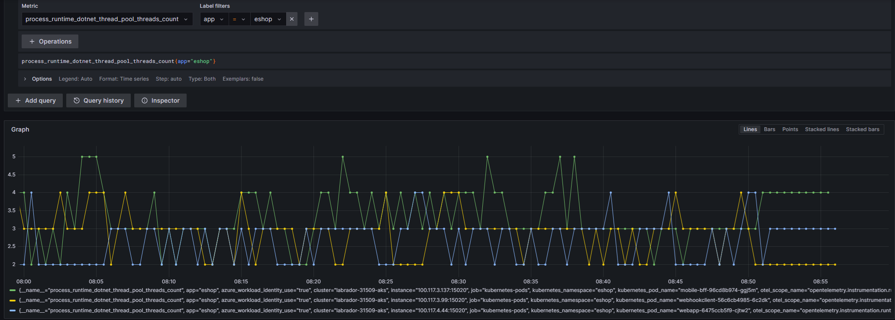
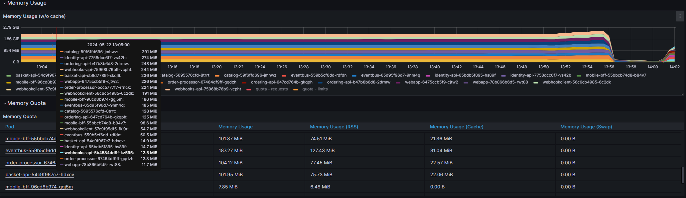
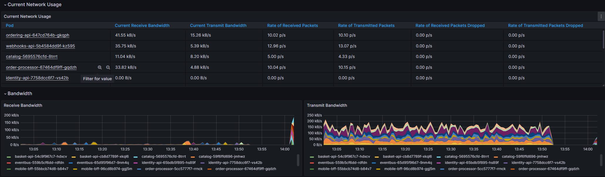
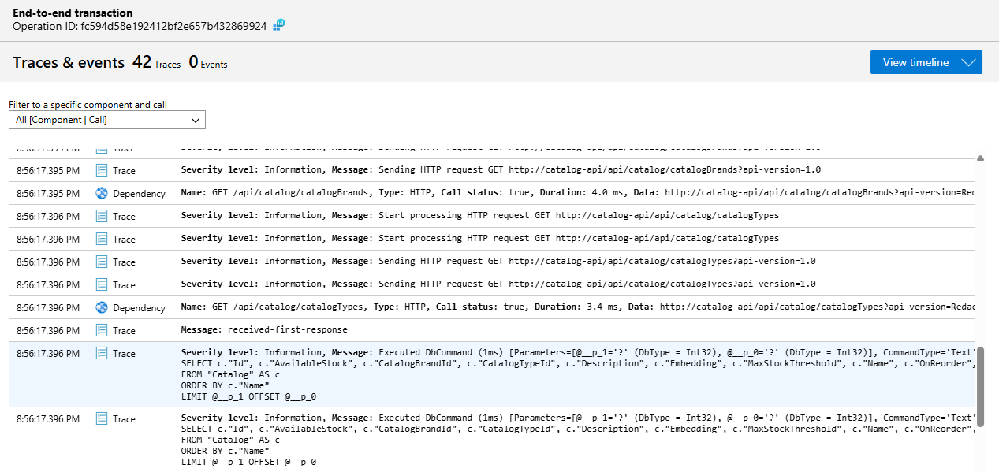
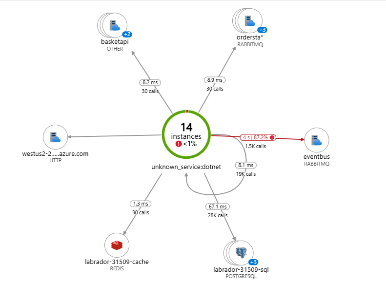
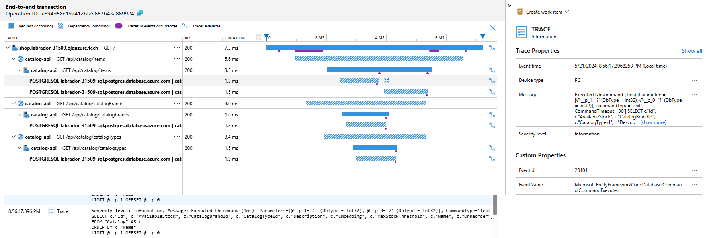

Monitoring
=============
* Azure Monitor Workspaces with Application Insights and Managed Grafna has been deployed for application monitoring.
* An Open Telemetry Collector, deployed in `otel-system` namespace on AKS, is used to collect and export metrics, logs, and traces to Azure Monitor.
* The OTEL pipeline is configured with Zipkin receiver for traces and OTLP receiver for metrics and logs.
* Azure Service Mesh is also configured to send logs to the OTEL Collector for distributed traces.
* Grafana dashboards have been created to visualize the metrics collected by the OTEL Collector. It has its own UI and can be accessed via the Azure Portal.
* Application Insights is used to monitor the application logs and distributed traces. It is accessible directly in the Azure Portal.
* Review the [code updates](./code.md) that was made to the eShop application to enable monitoring.

## Open Telemetry Pipeline
```yaml
  pipelines:
    traces:
      receivers: [zipkin]
      processors: [batch]
      exporters: [debug,azuremonitor]
    metrics:
      receivers: [otlp]
      processors: [batch]
      exporters: [debug,azuremonitor]
    logs:
      receivers: [otlp]
      processors: [batch]
      exporters: [debug,azuremonitor]
```
<p align="right">(<a href="#monitoring">back to top</a>)</p>

# Example Metrics - Grafana Dashboards and Prometheus Queries 
> The following are example metrics and queries that can be used to monitor the eShop application. 

## Threads


## Memory Usage


## Network

<p align="right">(<a href="#monitoring">back to top</a>)</p>

# Example Application Logs - Application Insights
> The following are just a sample of how Application Insights can be used to monitor the eShop application. 
## Logging


## Application Map

<p align="right">(<a href="#monitoring">back to top</a>)</p>

# Example Distributive Traces - Application Insights

<p align="right">(<a href="#monitoring">back to top</a>)</p>

# Optional Next Steps
* :bulb: Explore the Grafana dashboards to view additional metrics and dashboards
* :bulb: Create custom queries in Application Insights to monitor specific application logs. Create alerts based on these queries.
* :bulb: Create an Availability Test in Application Insights to monitor the application uptime from multiple locations
* :bulb: Deploy Hubble to monitor the network traffic between the services in the eShop application. Hubbble can be deployed with `task hubble`

# Navigation
[Previous Section ⏪](./deployment.md) ‖ [Return to Main Index 🏠](../README.md) ‖ [Next Section ⏩](./testing.md)
<p align="right">(<a href="#monitoring">back to top</a>)</p>