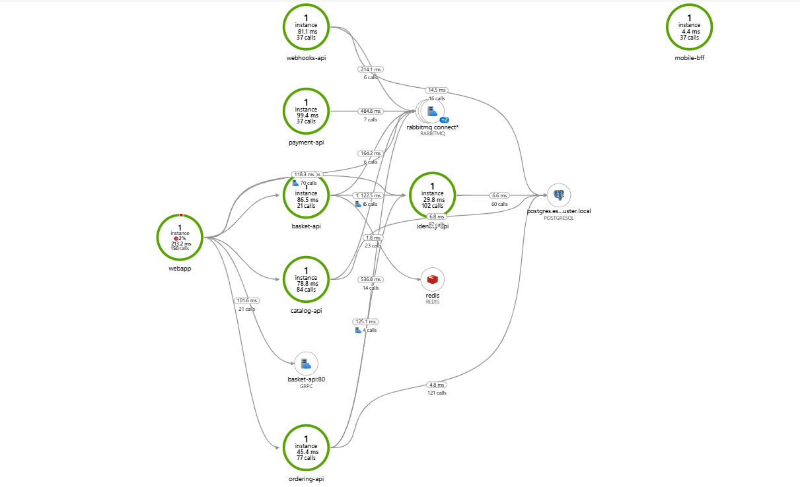

Monitoring
=============
TBD
<p align="right">(<a href="#monitoring">back to top</a>)</p>

# Open Telemetry Pipeline
```yaml
  pipelines:
    traces:
      receivers: [zipkin]
      processors: [batch]
      exporters: [debug,azuremonitor]
    metrics:
      receivers: [otlp]
      processors: [batch]
      exporters: [debug,azuremonitor]
    logs:
      receivers: [otlp]
      processors: [batch]
      exporters: [debug,azuremonitor]
```

# Metrics - Grafana Example Dashboards and Prometheus Queries 
## Threads


## Memory Usage


## Network

<p align="right">(<a href="#monitoring">back to top</a>)</p>

# Application Logs - Application Insights
## Logging


## Application Map

<p align="right">(<a href="#monitoring">back to top</a>)</p>

# Traces - Application Insights

<p align="right">(<a href="#monitoring">back to top</a>)</p>

# Navigation
[Previous Section ⏪](./deployment.md) ‖ [Return to Main Index 🏠](../README.md) ‖ [Next Section ⏩](./testing.md)
<p align="right">(<a href="#monitoring">back to top</a>)</p>