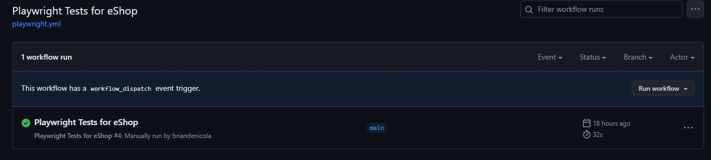
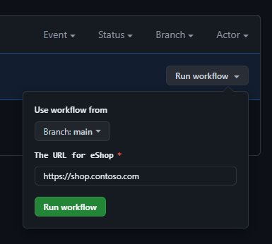
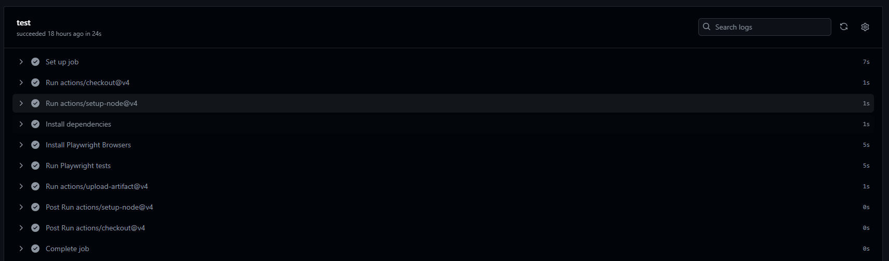
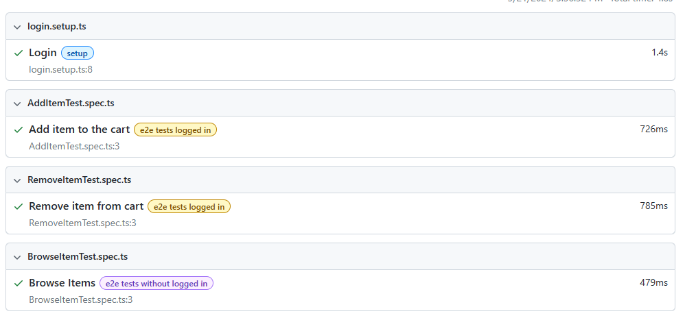
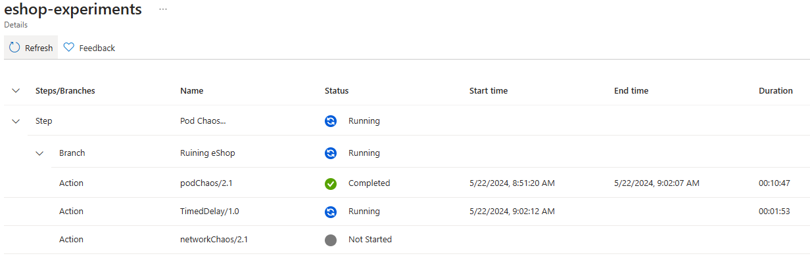
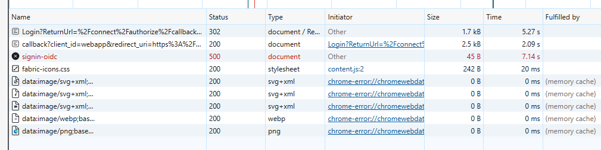
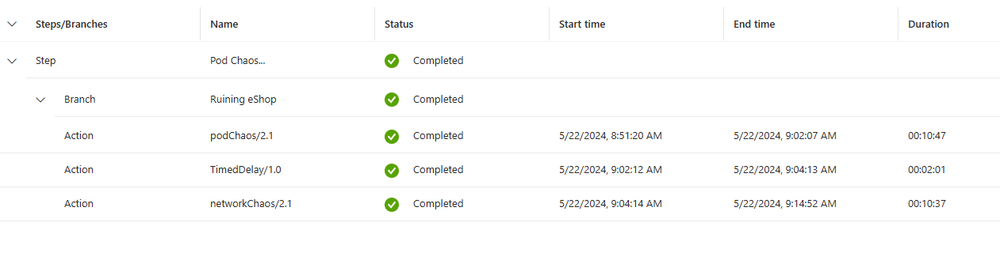

Testing and Troubleshooting
=============
* Playwright is the End to End testing framework for the eShop applciation.   It will be triggered using GitHub Actions.
* Chaos Engineering is used to simulate network delays and failures in the eShop application.

<p align="right">(<a href="#testing-and-troubleshooting">back to top</a>)</p>

# Playwright
* Playwright is a functional test framework that allows you to write tests in JavaScript, TypeScript, Python, and C#.
* The tests are written in TypeScript and are located in the `./tests` directory.
* The test results are stored as artifacts in the GitHub Actions workflow, which can be downloaded and viewed.

## GitHub Actions - Overview


## GitHub Actions - Kick Off
>> - **Note:** Change the URL to your specific URL for your deployment of the eShop application.



## GitHub Actions - Test Results


## Playwright - Artifacts & Detail Results

<p align="right">(<a href="#testing-and-troubleshooting">back to top</a>)</p>

# Chaos Engineering
## Setup 
```pwsh
    > cd ./experiments
    > task up
```
>> - **Note:** The above command will deploy the Chaos toolkit to AKS and configure the proper access to the cluster.
>> - **Note:** The command will also create a basic Chaos experiment to simulate network delays and pods failures in the eShop application.

## Run
* To trigger the experiment, log into the Azure Portal and navigate to the Chaos Experiments resource group, select the Chaos Experiment and click on the "Run" button.
* During the experiment, run `kubectl --namespace eshop -o wide -w` to monitor the status of the pods.
* You will see pods fail, and enter a "CrashLoopBackOff" state.  
* :question: How do you bring the pods back to a healthy state?



## Network Delays
* During this phase of the experiment, navigate to the application in your browser. 
* :question: How are the delays manifested within the application? 
* :question: Building on the monitoring section, can you find a dashboard or query that does the delays?


## Completion

>> - :question: What other steps or branches could be added to the Chaos Experiment?


<p align="right">(<a href="#testing-and-troubleshooting">back to top</a>)</p>

# Navigation
[Previous Section ⏪](./cost-management.md) ‖ [Return to Main Index 🏠](../README.md) 
<p align="right">(<a href="#testing-and-troubleshooting">back to top</a>)</p>