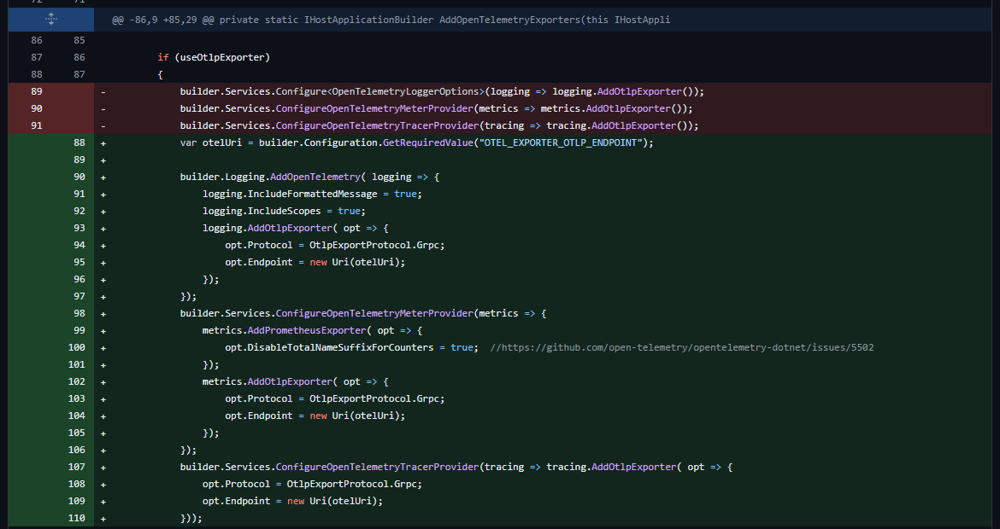

# Reference Implementation Source Code
* https://github.com/dotnet/eShop

# Code Updates
The follow changes have been made to the original source code to make it work with AKS and to enable Prometheus Metrics
> - https://github.com/briandenicola/eShop/commit/61913dbe2e94b0c460cc83d386b313fdb88f413d
> - https://github.com/briandenicola/eShop/commit/d40a535046c18729edadb72dd6956fd3caafa6fd

